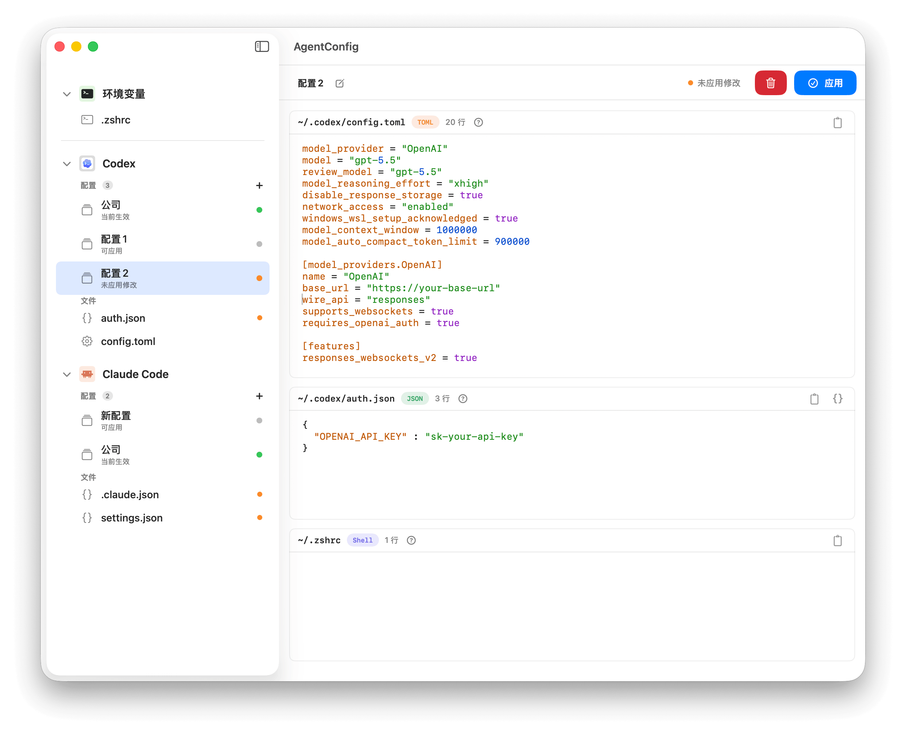

# AgentConfig

[](https://github.com/iHongRen/AgentConfig/releases) [](https://github.com/iHongRen/AgentConfig/releases)  [](./LICENSE)

[English](./README_en.md)

原生 macOS App，集中管理 Codex、Claude Code 的配置文件和多套方案切换。




## 安装

```sh
curl -fsSL https://raw.githubusercontent.com/iHongRen/AgentConfig/main/install.sh | sh
```

或从 [GitHub Releases](https://github.com/iHongRen/AgentConfig/releases) 下载 `AgentConfig.dmg`。如遇安全提示：

```sh
xattr -dr com.apple.quarantine /Applications/AgentConfig.app
```

## 功能

- **配置编辑** — 8 种语法高亮（JSON/YAML/TOML/Shell 等）、Cmd+F 搜索、JSON 格式化、外部变更检测
- **Profile 管理** — 多套方案一键切换，`.zshrc` 托管块不覆盖原有内容，事务写入失败自动回滚
- **侧边栏** — 自动扫描已知配置、可拖拽添加自定义路径、右键快捷操作、未保存标记


## 配置文件

| Agent | 文件 |
|-------|------|
| **Codex** | `~/.codex/config.toml`、`~/.codex/auth.json` |
| **Claude Code** | `~/.claude/settings.json`、`~/.claude.json` |
| **环境变量** | `.zshrc`、`.zprofile`、`.bashrc`、`.bash_profile` 等 |


