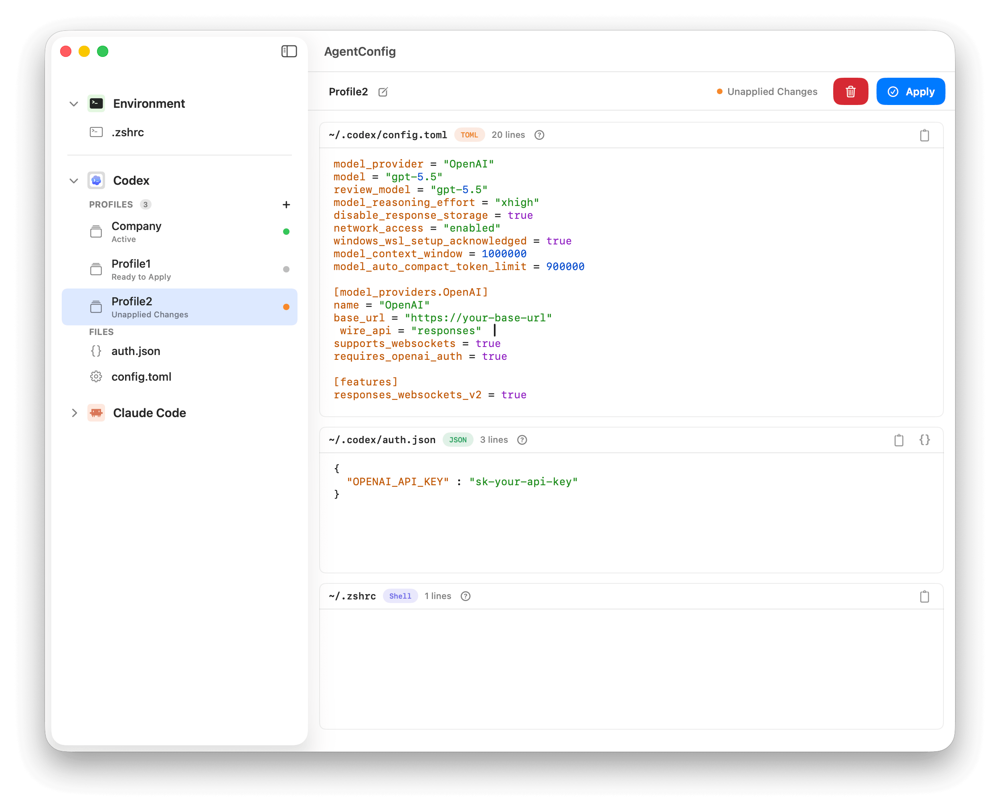

# AgentConfig

[](https://github.com/iHongRen/AgentConfig/releases) [](https://github.com/iHongRen/AgentConfig/releases)  [](./LICENSE)

A native macOS app for managing Codex and Claude Code config files and switching between profiles.



## Install

```sh
curl -fsSL https://raw.githubusercontent.com/iHongRen/AgentConfig/main/install.sh | sh
```

Or download `AgentConfig.dmg` from [GitHub Releases](https://github.com/iHongRen/AgentConfig/releases). If blocked by macOS Gatekeeper:

```sh
xattr -dr com.apple.quarantine /Applications/AgentConfig.app
```

## Features

- **Config Editor** — Syntax highlighting for 8 formats (JSON/YAML/TOML/Shell, etc.), Cmd+F search, JSON formatting, external change detection
- **Profile Manager** — One-click profile switching, managed `.zshrc` blocks that won't overwrite your own content, transactional writes with auto-rollback
- **Sidebar** — Auto-discovers config files, drag-and-drop custom paths, right-click shortcuts, unsaved change indicators

## Configs

| Agent | Files |
|-------|-------|
| **Codex** | `~/.codex/config.toml`, `~/.codex/auth.json` |
| **Claude Code** | `~/.claude/settings.json`, `~/.claude.json` |
| **Shell env** | `.zshrc`, `.zprofile`, `.bashrc`, `.bash_profile` etc. |
